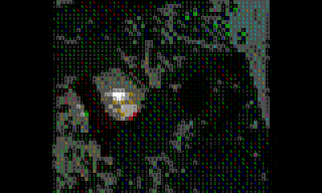

# Experiments

Animated GIFs are rendered **offline** from symbolic `.avm.npz` rollouts (glyph + xterm colors), not from terminal screenshots — so they are reproducible and independent of pane size.

## ApplyEyeMakeup POC

Seed class: ApplyEyeMakeup. Model generates continuation after a short context window.

## ApplyLipstick POC

Trained separately from eye-makeup (not mixed in the POC stage).

## Merged Apply\* smoke

Both makeup classes in one training run. Used for the first multi-clip smoke test.

## Multi-class UCF101-Videos

Smoke across the on-disk `UCF101-Videos` dump (beyond Apply\* only), when available.

---

Captions and metrics will be updated as training hardens (best-by-validation checkpoints).
