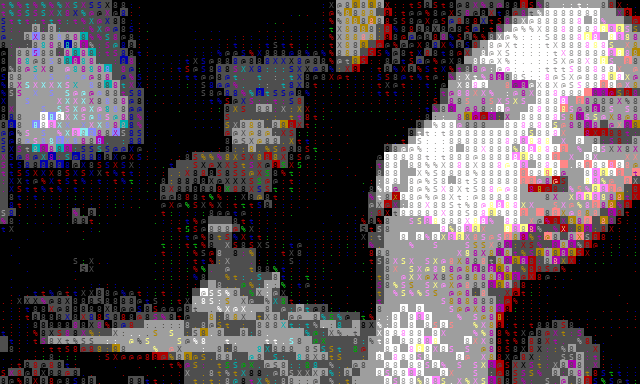
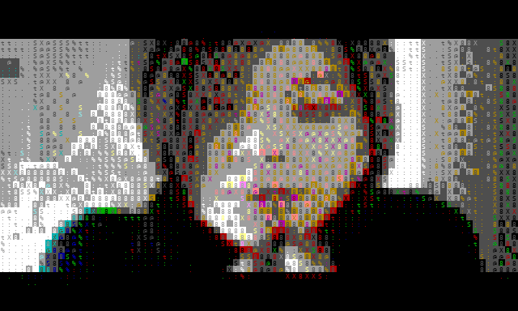

# neurASCII

A small neural video model that operates **natively on colored ASCII / libcaca-style video**, rather than on pixels.

**Code:** [Decentricity/neurascii](https://github.com/Decentricity/neurascii)

GIFs below are rendered offline from symbolic `.avm.npz` rollouts (glyph + xterm colors), not terminal screenshots.

## ApplyEyeMakeup POC

Single-class next-frame training (kept separate from lipstick). Seed context, then model continuation.

## ApplyLipstick POC

Trained separately from eye-makeup — not mixed in the POC stage.

## Merged Apply\* smoke

Both makeup classes in one run; first multi-clip smoke test.

## Hypothesis

libcaca (or a compatible ASCII renderer) can act as a **fixed perceptual encoder**. Training a temporal model directly on glyph + color lattices may learn coherent short-term video dynamics with far less capacity than pixel-space video models.

We do **not** yet claim compute efficiency versus equal-bandwidth pixel baselines — that comparison is scheduled after the Fullvideo scale-up.

## Method (MVP)

| Knob | Value |
|------|--------|
| Frame | 80×48 characters, 10 FPS |
| Cell | glyph + foreground + background (separate heads) |
| Palette | xterm-256 |
| Patches | 4×4 cells (240 patches/frame) |
| Model | ~32M decoder-style Transformer, next-frame prediction |
| Context | 8 frames |

Pipeline: `video → ffmpeg RGB → libcaca dither → .avm.npz → train → generate → terminal play / GIF`.

Trivial baselines (previous-frame copy, most-common token) are logged per run. Later runs use **early stopping** and **best-by-val** checkpoints.

## Data ladder

1. [`bitmind/UCF101-Videos`](https://huggingface.co/datasets/bitmind/UCF101-Videos) (~372MB partial upload) — current.
2. [`bitmind/UCF101Fullvideo`](https://huggingface.co/datasets/bitmind/UCF101Fullvideo) (~7GB / ~13k clips) — next scale.
3. Long-form / other domains (e.g. RedLetterMedia) — later.

## Non-goals (for now)

- Photoreal ASCII→video upscaling
- Hosting weights or source video on this Pages site
- Efficiency claims without matched pixel baselines
